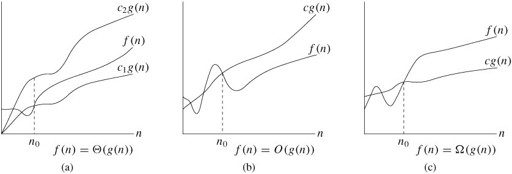
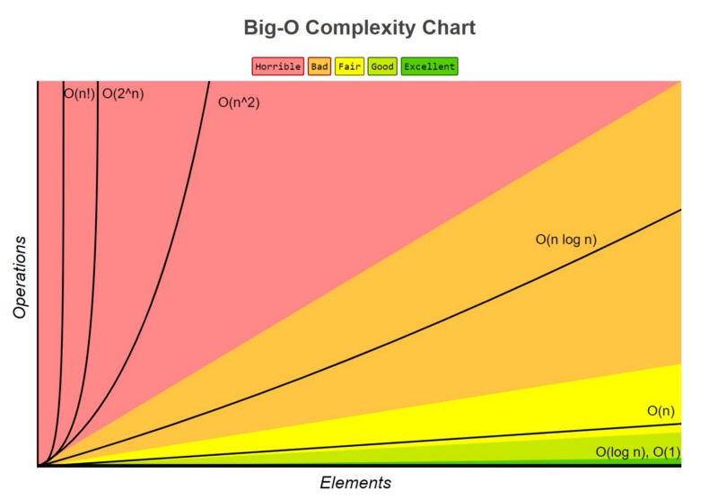
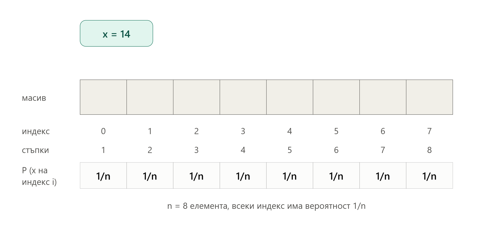

# Сложност на алгоритми
## Защо?
В по-голямата част от случаите пишем програми, за да изпълняват някаква конкретна цел (да решат някаква конкретна задача). Една задача има много начини за решаване, 
като всеки начин наричаме *алгоритъм*. Например можем да сортираме масив от елементи по много начини. 

Тук идва въпросът как точно да изберем алгоритъм, който да реши задачата. Нуждаем се от начин, по който да сравняваме алгоритми, за да изберем най-добрия от тях. Метриките, които
най-често биха ни интересували, са *колко време отнема на алгоритъма да си свърши работата* и *колко памет отнема на алгоритъма да си свърши работата*. Очевидно да измерваме точните
количества не би ни било от голяма полза, тъй като времето за изпълнение и необходимата памет силно зависят от това на каква архитектура и върху какъв хардуер се изпълнява програмата.

Затова се налага да дефинираме понятието *сложност*. Именно, сложност наричаме функция по големината на входа, която описва колко горе-долу стъпки прави алгоритъмът с увеличението
на размера на входа. Тъй като би ни интересувало как се представя алгоритъмът при много големи входове, няма да ни интересува това каква е точната функция на сложността, а
как тя расте, когато размерът на входа клони към безкрайност. Ако $`n`$ е размерът на входа, ни интересува каква е функцията при $`n \to \infty`$, 
тоест ни интересува нейната *асимптотика*.

## Нотация
За целта ще въведем следните множества, свързани с асимптотиката на функции: </br>
$`\Theta(g(n)) = \{f(n) \: | \: \exists c_1 \gt 0, c_2 \gt 0, n_0 \gt 0: \: c_1g(n) \le f(n) \le c_2g(n), \: \forall n \ge n_0\}`$ </br>
$`O(g(n)) = \{f(n) \: | \: \exists c \gt 0, n_0 \gt 0: \: f(n) \le cg(n), \: \forall n \ge n_0\}`$ </br>
$`\Omega(g(n)) = \{f(n) \: | \: \exists c \gt 0, n_0 \gt 0: \: cg(n) \le f(n), \: \forall n \ge n_0\}`$ </br>

</br>

### Big Theta
Множеството $`\Theta(g(n))`$ съдържа всички функции, които растат по същия начин като $`g(n)`$, когато $`n \to \infty`$. Две функции $`f(n)`$ и $`g(n)`$ растат по същия начин в безкрайността,
ако $`\lim_{n \to \infty} \frac{g(n)}{f(n)} = c`$, където $`0 < c < \infty`$. <br>
Например, ако $`g(n) = 2n + 3`$ и $`f(n) = n + 10`$, то $`f(n) \in \Theta(g(n))`$, защото $`\lim_{n \to \infty} \frac{2n + 3}{n + 10} = 2`$, което е между $`0`$ и $`\infty`$.
### Big O
Множеството $`O(g(n))`$ съдържа всички функции, които растат най-много като $`g(n)`$, тоест $`g(n)`$ се явява горна граница, когато $`n \to \infty`$.
Функцията $`f(n)`$ има горна граница $`g(n)`$ в безкрайността, ако $`\liminf_{n \to \infty} \frac{g(n)}{f(n)} > 0`$. Ако границата съществува, то $`\lim_{n \to \infty} \frac{g(n)}{f(n)} = c`$, където $`0 < c \le \infty`$. 
Ако $`\lim_{n \to \infty} \frac{g(n)}{f(n)} = \infty`$, то $`f(n)`$ расте *строго по-бавно* от $`g(n)`$. <br>
Например, ако $`g(n) = n^3 + 3n^2 - 10n + 5`$ и $`f(n) = n^2 + 5`$, то $`f(n) \in O(g(n))`$, защото $`\lim_{n \to \infty} \frac{n^3 + 3n^2 - 10n + 5}{n^2 + 5} = \infty > 0`$
### Big Omega
Множеството $`\Omega(g(n))`$ съдържа всички функции, които растат поне като $`g(n)`$, тоест $`g(n)`$ се явява долна граница, когато $`n \to \infty`$.
Функцията $`f(n)`$ има долна граница $`g(n)`$ в безкрайността, ако $`\limsup_{n \to \infty} \frac{g(n)}{f(n)} < \infty`$. Ако границата съществува, то $`\lim_{n \to \infty} \frac{g(n)}{f(n)} = c`$, където $`0 \le c < \infty`$.
Ако $`\lim_{n \to \infty} \frac{g(n)}{f(n)} = 0`$, то $`f(n)`$ расте *строго по-бързо* от $`g(n)`$. <br>
Например, ако $`g(n) = n^2 + 5`$ и $`f(n) = n^3 + 3n^2 - 10n + 5`$, то $`f(n) \in \Omega(g(n))`$, защото $`\lim_{n \to \infty} \frac{n^2 + 5}{n^3 + 3n^2 - 10n + 5} = 0 < \infty`$

### Популярни множества
В таблицата долу са дадени най-често срещаните множества функции, подредени в нарастващ ред по растежът им.
<table>
  <tr><th>Име</th><th>Множество</th></tr>
  <tbody>
    <tr><td>Константна</td><td>$\Theta(1)$</td></tr>
    <tr><td>Логаритмична</td><td>$\Theta(logn)$</td></tr>
    <tr><td>Линейна</td><td>$\Theta(n)$</td></tr>
    <tr><td>Линеаритмична (логлинейна; с линейно-логаритмичен растеж)</td><td>$\Theta(nlogn)$</td></tr>
    <tr><td>Квадратична</td><td>$\Theta(n^2)$</td></tr>
    <tr><td>Експоненциална</td><td>$\Theta(2^n)$</td></tr>
    <tr><td>Факториелна</td><td>$\Theta(n!)$</td></tr>
  </tbody>
</table>


## Величини
При анализът на алгоритми се интересуваме ресурси в какъв порядък се използват най-много, средно и най-малко. Това са така наречените *worst-case*, *average-case* и *best-case* сложности.

### Пример - linear search
***От сега нататък размерът на входния масив ще бъде n.*** </br>

Ще направим анализ на сложността по време (time complexity) в best-case, average-case и worst-case на стандартното линейно търсене, чиято примерна имплементация е дадена тук: </br>
```c++
#include <vector>

int linearSearch(std::vector<int>& arr, int target) {
	for (int i = 0; i < arr.size(); i++) {
		if (arr[i] == target) return i;
	}
	return -1;
}
```
#### Best-case
Най-бързо би работил алгоритъмът, ако търсеният елемент е първият (на индекс 0) елемент на масива. В такъв случай без значение от размера на масива винаги ще се прави константен брой стъпки. Тоест, best-case сложността по време на линейното търсене е $`\Theta(1)`$.
#### Worst-case
Най-бавно би работил алгоритъмът, ако търсеният елемент не се съдържа в масива. В такъв случай алгоритъмът ще приключи изпълнение след като минем през всички $`n`$ елемента на масива. Ако масивът има 100 елемента, ще направим приблизително 100 операции; ако има 1000 елемента - приблизително 1000 операции и т.н. Тоест, worst-case сложността по време на линейното търсене е $`\Theta(n)`$. 
#### Average-case
При пресмятането на best-case и worst-case правихме предположения относно състава на масива, които доста улесняваха пресмятането на сложността. Тук се налага да сметнем как се представя алгоритъмът в средния случай - тоест когато не знаем абсолютно нищо за входния масив. Това е очевидно доста по-трудно от пресмятането на другите два случая. 

Както и за другите два случая ще сумираме стъпките, които извършва алгоритъмът. Нека търсеният елемент е $`x`$. Тъй като не знаем нищо за масива, ще направим предположението, че е равновероятно елементът $`x`$ да се съдържа на всяка една позиция в масива. С други думи, вероятността $`x`$ да е на индекс 0 е същата като вероятността да е на индекс 1, на индекс 2 и т.н.

Ако $`x`$ е на индекс 0, то ще направим 1 стъпка (както беше и в best-case); ако $`x`$ е на индекс на 1, то ще направим 2 стъпки (проверяваме елементът на индекс 0, след това този на индекс 1 и спираме) и т.н. </br>
По-общо казано, ако $`x`$ се намира на индекс $`i`$, то ще направим $`i + 1`$ стъпки. 

Сега смятаме *математическото очакване* $`E`$, тоест средния брой стъпки, които алгоритъмът ще направи: </br>
$`E = \sum_{i=0}^{n} \frac{1}{n}(i + 1) = \frac{1}{n}(1 + 2 + 3 + \ldots + n + (n + 1))`$ </br>
Сумата в скобите е добре познатата сума на аритметична прогресия със стъпка 1. </br> </br>
$`E = \frac{1}{n} \frac{(n + 1)(n + 2)}{2} = \ldots = \frac{n+3}{2} + \frac{1}{n}`$ </br> </br>
Очевидно $E(n) \in \Theta(n)$, тоест average-case сложността по време на линейното търсене е линейна.

</br>

### Пример - binary search
Ще направим анализ на сложността по време (time complexity) в best-case, average-case и worst-case и на стандартното двоично търсене (binary search), чиято примерна имплементация е дадена тук: </br>
```c++
#include <vector>

int binarySearch(std::vector<int>& arr, int target) {
	int start = 0, end = arr.size() - 1;
	while (start <= end) {
		int mid = end + (start - end) / 2;
		if (target == arr[mid]) return mid;
		else if (target < arr[mid]) end = mid - 1;
		else start = mid + 1;
	}
	return -1;
}
```
#### Best-case
Най-бързо би работил алгоритъмът, ако търсеният елемент е в средата на входния масив. В такъв случай без значение от размера на масива винаги ще се прави константен брой стъпки. Тоест, best-case сложността по време на двоичното търсене е $`\Theta(1)`$.
#### Worst-case
Най-бавно би работил алгоритъмът, ако търсеният елемент не се съдържа в масива. На всяка стъпка отмятаме около половината останали елементи на масива.
<table>
  <tr><th># итерация</th><th>Брой елементи на масива</th></tr>
  <tbody>
    <tr><td>0</td><td>$n$</td></tr>
    <tr><td>1</td><td>$\frac{n}{2}$</td></tr>
    <tr><td>2</td><td>$\frac{n}{4}$</td></tr>
    <tr><td>3</td><td>$\frac{n}{8}$</td></tr>
    <tr><td colspan=2 align="center">...</td></tr>
    <tr><td>k</td><td>$\frac{n}{2^k}$</td></tr>
  </tbody>
</table>

Последната итерация на алгоритъма е, когато останем с 1 елемент. Тоест, когато $\frac{n}{2^k} = 1$. 

След като решим уравнението спрямо $`k`$ получаваме, че броят на итерациите, които алгоритъмът прави е $`k = log_2 n`$. Тоест, worst-case сложността по време на двоичното търсене е $`\Theta(logn)`$.

#### Average-case
Както и за другите два случая ще сумираме стъпките, които извършва алгоритъмът. Нека търсеният елемент е $`x`$. Тъй като не знаем нищо за масива, пак правим предположението, че е равновероятно елементът $`x`$ да се съдържа на всяка една позиция в масива.

Ако $`x`$ е на средния индекс на масива, ще направим 1 стъпка (както беше и в best-case). В противен случай ще отидем или наляво, или надясно. Тоест имаме 2 варианта за следващ среден индекс. Ако $`x`$ се намира някой от тях, алгоритъмът ще спре. В противен случай от всеки от двата варианта за среда ще отидем или наляво, или надясно, водейки до общо 4 варианта за следващ среден индекс и т.н. Максималният брой смятания на среден индекс е $`log_2 n`$, понеже на всяка стъпка махаме около половината елементи от масива. </br>
Обобщено: </br>
<table>
  <tr><th># итерация</th><th>Брой проверки</th><th>Брой възможни средни елементи</th></tr>
  <tbody>
    <tr><td>0</td><td>1</td><td>1</td></tr>
    <tr><td>1</td><td>2</td><td>2</td></tr>
    <tr><td>2</td><td>3</td><td>4</td></tr>
    <tr><td>3</td><td>4</td><td>8</td></tr>
    <tr><td colspan=3 align="center">...</td></tr>
    <tr><td>$log_2 n$</td><td>$log_2 n - 1$</td><td>$2^{\lceil log_2 n \rceil}$</td></tr>
  </tbody>
</table>

Отново смятаме *математическото очакване* $`E`$, тоест средния брой стъпки, които алгоритъмът ще направи: </br>
$`E = \sum_{i=0}^{\lceil log_2 n \rceil} \frac{1}{n}[(i + 1) * 2^i] = \ldots = \frac{\lceil log_2 n \rceil * 2^{\lceil log_2 n \rceil + 1} + 1}{n}`$. </br> </br>
$`2^{\lceil log_2 n \rceil + 1}`$ е приблизително $`n`$ и $`\lceil log_2 n \rceil`$ e приблизително $`log_2 n`$. Оттам $`E \approx \frac{log_2 n * 2n + 1}{n}`$, и след малко преобразувания може да видим, че $`E(n) \in \Theta(logn)`$, тоест average-case сложността по време на двоичното търсене също е логаритмична.
